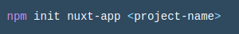
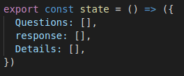
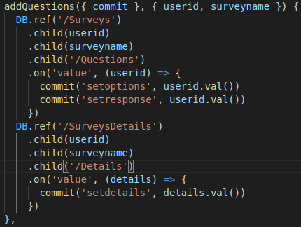
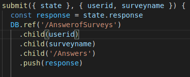
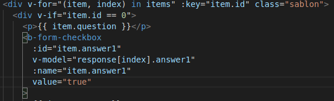

# MakeSurvey WEB

 # YAPIM AŞAMALARI

 ## **Proje oluşturulması**
Sistemimizin çalışma prensibi yazılan adrese göre sistemimizde bulunan anketi yazdırıp cevap isteniyor. Adres şablonu /surveys/kullanıcıid/anketismi. Gelen kullanıcı id ve anket ismi ile anketi belirleyip yazdırıyoruz. Alınan cevabı kullanıcı idsine göre kaydediyoruz.

Öncelikle Node.js platformu üzerinde nuxt.js projesi oluşturuyoruz. 

* Nuxt.js projesi oluşturma

Şekildeki kodu konsola yazdığımızda birkaç soru soruyor. Soruları cevapladıktan sonra boş bir proje oluşturulmuş oluyor.  
 ## **Firebase eklenmesi**
Bu boş proje içerinde ilk önce firebase sistemimizi tanıtıyoruz.

* Firebase ekleme

Şekildeki kod bloğu sayesinde firebase sistemini web apimıza ekliyoruz.

 ## **Adres Yolunun Belirlenmesi**
Nuxt.js sayesinde adres şablonunu belirlemek çok kolaylaşıyor. Klasör sistemiyle otomatik adres belirleniyor.

* Adres yolunun belirlenmesinin klasör sistemi

Şekildeki gibi bir klasör sistemi yapıyoruz. Böylece nuxt nasıl bir adres şablonumuz olduğunu anlayıp otomatik ayarlıyor. Burada dinamik bir adres oluşturuyoruz. Kullanıcı id ve anket ismine göre adresler belirleniyor.
 ## **Store oluşturulması**
Vuex sayesinde store oluşturuyoruz. Store içerisinde 3 adet state belirliyoruz. Bunlar sorular, cevaplar ve detaylar.

* State’ler

Gelen adrese göre çalışacak actionları yazıyoruz. Bunlar soru ekleme ve cevap kaydetme.

* Soru ekleme actionu

Soru ekleme actionunda gelen adresten alınan kullanıcı idsi ve anket ismi ile firebase sistemimizden anket sorularını ve detaylarını alıyor.

* Kaydet actionu

Şekildeki kaydet actionu ise kullanıcıdan aldığı cevapları sisteme yüklememizi sağlıyor.
## **Sayfa oluşturulması** 
Vue’nin bir özelliği olan v-for döngüsü sayesinde dinamik bir sayfa oluşturduk. Kullanıcının kaç sorusu olursa olsun sayfaya yazmamızı sağlar. Vue’nin bir mekaniği olan v-model sayesinde hangi soruya cevap verildiğini dinamik olarak öğreniyoruz.

* V-for döngüsü

Şekilde görünen kod bloğu v-for döngünün yazılış şeklini gösteriyor. Buradaki item vuex sayesinde firebase sistemimizden çekiliyor ve sayfamıza ulaştırılıyor. 
